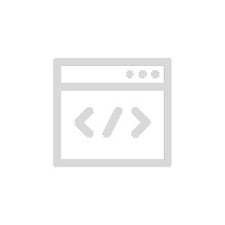

<h1 align="center">Bruno Mota</h1>

    

<em>Formado em análise e desenvolvimento de sistemas na UNINOVE, já atuei como desenvolvedor front-end e back-end. E trabalhei com as seguintes tecnologias: <b>HTML</b>, <b>CSS</b>, <b>JavaScript</b>, <b>WordPress</b>, <b>PHP</b>, <b>Laravel</b>, <b>Vue.js</b>, <b>MySQL</b>, <b>VTEX</b> e <b>Docker</b></em>

<i>Possuo mais de 3 anos de experiência com o atendimento ao cliente (telemarketing receptivo), com produtos de consórcio, internet, bancos, seguros, telefone e computadores. Nas áreas de SAC, Backoffice, Suporte Técnico, Auditoria e Cobrança.</i>

      

